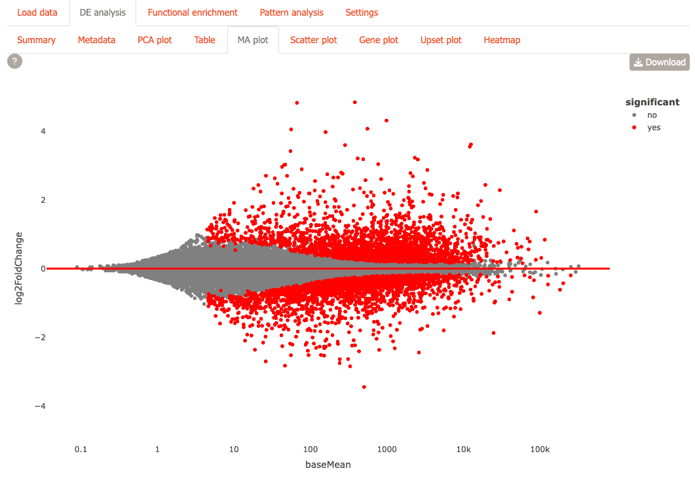
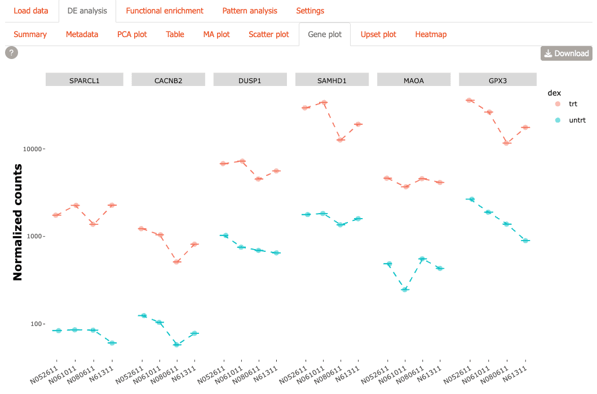
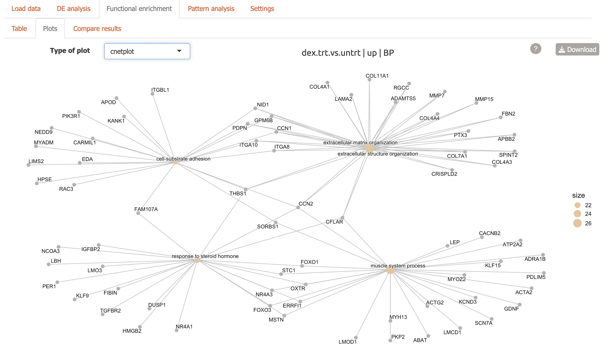
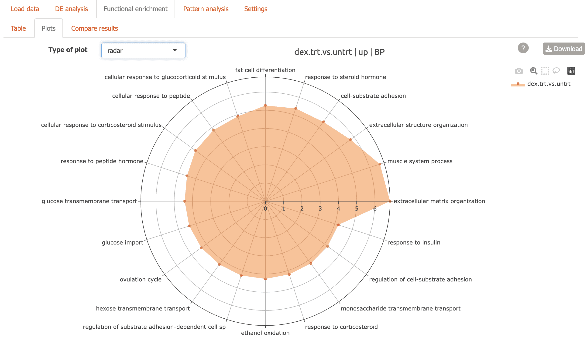
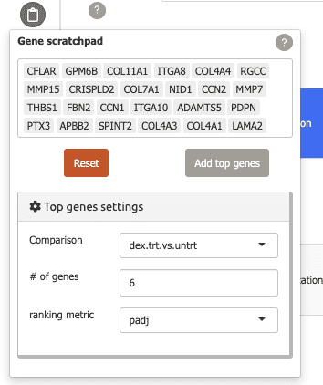

# carnation - airway tutorial

Abstract

Carnation is an interactive Shiny dashboard that simplifies and
transforms complex bulk RNA-Seq data using insightful visualizations and
numerous interactive features. Designed for both computational and
experimental biologists, Carnation makes exploring differential
expression analysis, functional enrichment, and pattern analysis
intuitive and exciting. In this vignette, we will describe some of its
functionality using the `airway` dataset. Carnation package version:
0.99.6

### Load libraries & airway dataset

First check for and load some libraries that we will need for this
tutorial.

``` r

# install optional packages if not present
pkgs_to_check <- c('airway', 'org.Hs.eg.db', 'DEGreport')
for(pkg in pkgs_to_check){
  setRepositories(ind=c(1,2,3,4,5))
  if(!requireNamespace(pkg, quietly=TRUE)){
    install.packages(pkg, repos='http://cran.us.r-project.org')
  }
}
```

``` r

library(airway)
library(DESeq2)
library(dplyr)
library(GeneTonic)
library(org.Hs.eg.db)
```

We will be using the ‘airway’ dataset. First, we load this dataset.

``` r

data('airway')
```

Next, we extract the counts matrix and and metadata.

``` r

mat <- assay(airway)
cdata <- colData(airway)
```

Now let’s see what these look like.

``` r

dim(mat)
#> [1] 63677     8
```

So, `mat` is a matrix with 64102 rows and 8 columns. Each row
corresponds to a single gene and each column corresponds to a single
sample. As you will notice, the rownames of `mat` contains gene IDs and
column names have the sample IDs.

``` r

head(mat)
#>                 SRR1039508 SRR1039509 SRR1039512 SRR1039513 SRR1039516
#> ENSG00000000003        679        448        873        408       1138
#> ENSG00000000005          0          0          0          0          0
#> ENSG00000000419        467        515        621        365        587
#> ENSG00000000457        260        211        263        164        245
#> ENSG00000000460         60         55         40         35         78
#> ENSG00000000938          0          0          2          0          1
#>                 SRR1039517 SRR1039520 SRR1039521
#> ENSG00000000003       1047        770        572
#> ENSG00000000005          0          0          0
#> ENSG00000000419        799        417        508
#> ENSG00000000457        331        233        229
#> ENSG00000000460         63         76         60
#> ENSG00000000938          0          0          0
```

`cdata` contains the sample metadata. There is a lot of information
here, but notice the `cell` and `dex` columns, as we will be using this
for the differential expression analysis later.

``` r

cdata
#> DataFrame with 8 rows and 9 columns
#>            SampleName     cell      dex    albut        Run avgLength
#>              <factor> <factor> <factor> <factor>   <factor> <integer>
#> SRR1039508 GSM1275862  N61311     untrt    untrt SRR1039508       126
#> SRR1039509 GSM1275863  N61311     trt      untrt SRR1039509       126
#> SRR1039512 GSM1275866  N052611    untrt    untrt SRR1039512       126
#> SRR1039513 GSM1275867  N052611    trt      untrt SRR1039513        87
#> SRR1039516 GSM1275870  N080611    untrt    untrt SRR1039516       120
#> SRR1039517 GSM1275871  N080611    trt      untrt SRR1039517       126
#> SRR1039520 GSM1275874  N061011    untrt    untrt SRR1039520       101
#> SRR1039521 GSM1275875  N061011    trt      untrt SRR1039521        98
#>            Experiment    Sample    BioSample
#>              <factor>  <factor>     <factor>
#> SRR1039508  SRX384345 SRS508568 SAMN02422669
#> SRR1039509  SRX384346 SRS508567 SAMN02422675
#> SRR1039512  SRX384349 SRS508571 SAMN02422678
#> SRR1039513  SRX384350 SRS508572 SAMN02422670
#> SRR1039516  SRX384353 SRS508575 SAMN02422682
#> SRR1039517  SRX384354 SRS508576 SAMN02422673
#> SRR1039520  SRX384357 SRS508579 SAMN02422683
#> SRR1039521  SRX384358 SRS508580 SAMN02422677
```

### Get more gene annotation

The gene IDs that come with the dataset are from ENSEMBL and are not
human-readable. So, next we will extract gene symbols and `ENTREZID` for
these genes from the `org.Hs.eg.db` package.

``` r

keytypes <- list('SYMBOL'='SYMBOL', 'ENTREZID'='ENTREZID')

anno_df <- do.call('cbind',
             lapply(keytypes, function(x){
               mapIds(org.Hs.eg.db,
                 column=x,
                 keys=rownames(mat),
                 keytype='ENSEMBL')
               })
             )

# convert to data frame
anno_df <- as.data.frame(anno_df)
```

Now, we have human readable gene names in the `SYMBOL` column and Entrez
IDs in the `ENTREZ` column.

``` r

head(anno_df)
#>                 SYMBOL ENTREZID
#> ENSG00000000003 TSPAN6     7105
#> ENSG00000000005   TNMD    64102
#> ENSG00000000419   DPM1     8813
#> ENSG00000000457  SCYL3    57147
#> ENSG00000000460  FIRRM    55732
#> ENSG00000000938    FGR     2268
```

### Create DESeqDataSet

Next, we create a new `DESeqDataSet` using `mat` and `cdata`.

``` r

dds <- DESeqDataSetFromMatrix(mat,
                              colData=cdata,
                              design=~cell + dex)
```

Let’s check to make sure that everything looks okay:

``` r

dds
#> class: DESeqDataSet 
#> dim: 63677 8 
#> metadata(1): version
#> assays(1): counts
#> rownames(63677): ENSG00000000003 ENSG00000000005 ... ENSG00000273492
#>   ENSG00000273493
#> rowData names(0):
#> colnames(8): SRR1039508 SRR1039509 ... SRR1039520 SRR1039521
#> colData names(9): SampleName cell ... Sample BioSample
```

Then we save `dds` in a list.

``` r

dds_list <- list(main=dds)
```

We also normalize the counts data and save it in a list.

``` r

rld_list <- lapply(dds_list, function(x) varianceStabilizingTransformation(x, blind=TRUE))
```

### Run differential expression analysis

Now, the object `dds` is ready for differential expression (DE)
analysis.

``` r

dds <- DESeq(dds)
#> estimating size factors
#> estimating dispersions
#> gene-wise dispersion estimates
#> mean-dispersion relationship
#> final dispersion estimates
#> fitting model and testing
```

Since, we used `design=~cell + dex` while creating `dds`, the above step
will automatically calculate some comparisons.

``` r

resultsNames(dds)
#> [1] "Intercept"               "cell_N061011_vs_N052611"
#> [3] "cell_N080611_vs_N052611" "cell_N61311_vs_N052611" 
#> [5] "dex_untrt_vs_trt"
```

The last comparison `dex_untrt_vs_trt` contains the effect of the `dex`
treatment, while the other comparisons compare different cell lines.
Next, we will extract two of these results and run `lfcShrink` on them.

For the `cell` comparison, we choose a precomputed results using the
`coef` parameter.

``` r

cell_comparison <- lfcShrink(dds,
                             coef='cell_N61311_vs_N052611',
                             type='normal')
```

For the `dex` comparison, we use `contrast` to specify the direction of
the comparison, since we want to use `untrt` as control.

``` r

dex_comparison <- lfcShrink(dds,
                            contrast=c('dex', 'trt', 'untrt'),
                            type='normal')
```

Now, each of these comparisons, contain the DE analysis results. For
example,

``` r

head(dex_comparison)
#> log2 fold change (MAP): dex trt vs untrt 
#> Wald test p-value: dex trt vs untrt 
#> DataFrame with 6 rows and 6 columns
#>                   baseMean log2FoldChange     lfcSE      stat      pvalue
#>                  <numeric>      <numeric> <numeric> <numeric>   <numeric>
#> ENSG00000000003 708.602170     -0.3741527 0.0988429 -3.787752 0.000152016
#> ENSG00000000005   0.000000             NA        NA        NA          NA
#> ENSG00000000419 520.297901      0.2020620 0.1097395  1.842943 0.065337292
#> ENSG00000000457 237.163037      0.0361672 0.1383377  0.264356 0.791505742
#> ENSG00000000460  57.932633     -0.0844567 0.2498904 -0.307054 0.758801924
#> ENSG00000000938   0.318098     -0.0841390 0.1513343 -0.393793 0.693733530
#>                       padj
#>                  <numeric>
#> ENSG00000000003 0.00128292
#> ENSG00000000005         NA
#> ENSG00000000419 0.19646985
#> ENSG00000000457 0.91141962
#> ENSG00000000460 0.89500478
#> ENSG00000000938         NA
```

Then, we save these results in a special nested list that `carnation`
will use. Here,

- `res` contains the actual DE analysis results
- `dds` contains the name of the DESeqDataSet used for the DE analysis.
  These values should map to `dds_list` names
- `label` is a description of the comparison

``` r

res_list <- list(
        dex_trt_vs_untrt=list(
            res=dex_comparison,
            dds='main',
            label='dex, treated vs untreated'),
        cell_N61311_vs_N052611=list(
            res=cell_comparison,
            dds='main',
            label='cell, N61311 vs N052611')
        )
```

Finally, we add `SYMBOL` and `ENTREZID` columns to the DE results from
the `anno_df` data frame.

``` r

res_list <- lapply(res_list, function(x){
              # save the rownames as a new 'gene' column
              x$res[[ 'gene' ]] <- rownames(x$res)

              # add 'SYMBOL' and 'ENTREZID' columns
              x$res[[ 'SYMBOL' ]] <- anno_df[rownames(x$res), 'SYMBOL']
              x$res[[ 'ENTREZID' ]] <- anno_df[rownames(x$res), 'ENTREZID']

              x
            })
```

### Add functional enrichment results (optional)

Now we run functional enrichment on the DE genes from the two
comparisons. For this, we first set significance thresholds and then
extract the DE genes and save as a list.

``` r

# padj cutoff
alpha <- 0.01

# log2FoldChange threshold; 1 == 2x difference
lfc_threshold <- 1

# list to save DE genes
de.genes <- lapply(res_list, function(x){
              # changed genes
              idx <- x$res$padj < alpha &
                     !is.na(x$res$padj) &
                     abs(x$res$log2FoldChange) >= lfc_threshold

              # return DE genes as a dataframe
              x$res[idx, c('gene', 'ENTREZID')]
            })
```

Next, we run functional enrichment and save the results in a list called
`enrich_list`. We also save a converted list called `genetonic` which
carnation uses for several plots from the `GeneTonic` package.

Since, this is a time-consuming step, we will use the pre-computed
enrichment results included with carnation.

``` r

# fe results from dex comparison
data(eres_dex, package='carnation')

# fe results from dex comparison
data(eres_cell, package='carnation')

# compile into a list
go_list <- list(dex_trt_vs_untrt=eres_dex, cell_N61311_vs_N052611=eres_cell)

# list to save functional enrichment results
enrich_list <- list()

# list to save a converted object for GeneTonic plots
genetonic <- list()

for(comp in names(res_list)){
    # NOTE: this is the command used to generate the functional
    # enrichment results
    #go.res <- clusterProfiler::enrichGO(
    #        gene=de.genes[[comp]][['ENTREZID']],
    #        keyType='ENTREZID',
    #        OrgDb=org.Hs.eg.db,
    #        ont='BP',
    #        pvalueCutoff=1, qvalueCutoff=1,
    #        readable = TRUE)

    # we use the precomputed results here instead
    go.res <- go_list[[ comp ]]

    enrich_list[[ comp ]] <- list(
                               res=comp,
                               changed=list( BP=as.data.frame(go.res) )
                             )

    genetonic[[ comp ]] <- list(
                             res=comp,
                             changed=list(
                               BP=carnation::enrich_to_genetonic(go.res, res_list[[comp]]$res)
                             )
                           )

}
#> Found 2483 gene sets in `enrichResult` object, of which 2483 are significant.
#> Converting for usage in GeneTonic...
#> Found 3706 gene sets in `enrichResult` object, of which 3706 are significant.
#> Converting for usage in GeneTonic...
```

`enrich_list` is a nested list where:

- The top-level names are unique keys/identifiers
- The second level corresponds to direction of change, e.g. `up`, `down`
  or `changed`. This level also contains a special entry `res` which
  maps to `res_list` names, as a way to record where the DE results came
  from.
- The third level corresponds to the ontology, e.g. `BP` (GO Biological
  Process).

Here, we are just using changed genes and the GO Biological Process (BP)
ontology, so `enrich_list` looks like:

    enrich_list
      ├─ dex_trt_vs_untrt
      │    ├─ res = 'des_trt_vs_untrt'    <--- comparison used to get FE results
      │    └─ changed
      │         └─ BP                     <--- functional enrichment results
      │
      └─ cell_N61311_vs_N052611
           ├─ res = 'cell_N61311_vs_N052611'    <--- comparison used to get FE results
           └─ changed
                └─ BP                           <--- functional enrichment results

`genetonic` mirrors the same structure.

### Add pattern analysis (optional)

Finally, we add some pattern analysis for the `dex_trt_vs_untrt`
comparison using the `DEGreport` package. First, we extract normalized
data for the 755 DE genes from this comparison.

``` r

# extract normalized data & metadata
ma <- assay(rld_list[['main']])
colData.i <- colData(rld_list[['main']])

# only keep data from DE genes
idx <- rownames(ma) %in% de.genes[['dex_trt_vs_untrt']][['gene']]
ma.i <- ma[idx,]

# remove any genes with 0 variance
ma.i <- ma.i[rowVars(ma.i) != 0, ]
```

Then, we run the pattern analysis, using `cell` as the *time* variable
and `dex` as the *color* variable.

Again, since this is a time-consuming step, we will use the pre-computed
pattern analysis results included with carnation.

``` r

# NOTE: This is the command used to perform pattern analysis
# degpatterns_dex <- DEGreport::degPatterns(
#                      ma.i,
#                      colData.i,
#
#                      time='cell',
#                      col='dex',
#
#                      # NOTE: reduce and merge cutoff----------------------------------------
#                      #   Reduce will merge clusters that are similar; similarity determined
#                      #   by cutoff
#                      reduce=TRUE,
#
#                      plot=FALSE
#                    )

# We use the pre-computed results here instead
data(degpatterns_dex, package='carnation')
```

Next, we extract the `normalized` slot from this object and save as a
list.

``` r

# extract normalized slot and add symbol column
p_norm <- degpatterns_dex$normalized
p_norm[[ 'SYMBOL' ]] <- anno_df[p_norm[['genes']], 'SYMBOL']

# save pattern analysis results
degpatterns <- list(dex_by_cell=p_norm)
```

### Compose carnation object

Now we have all the pieces to build the carnation object.

``` r

combined <- list(res_list=res_list,
                 dds_list=dds_list,
                 rld_list=rld_list,
                 enrich_list=enrich_list,
                 genetonic=genetonic,
                 degpatterns_list=degpatterns)
saveRDS(combined, 'carnation_vignette.rds', compress=FALSE)
```

### Data Organization

Organize your data in a directory structure that Carnation can easily
navigate, e.g. in a folder `carnation/data` in your home directory.
Here, we make a subfolder `airway` in this folder and copy the `RDS`
file we created above.

    ~/carnation/data/
      └─ airway
         └─ carnation-vignette.rds

Now, we’re ready for the first run.

### First Run

Load the carnation package.

``` r

library(carnation)
#> 
#> Attaching package: 'carnation'
#> The following object is masked from 'package:GeneTonic':
#> 
#>     gs_radar
```

Carnation allows you to download interactive plots as PDF. To use this
functionality you need to install some required Python dependencies:

``` r

install_carnation()  # Installs plotly and kaleido for PDF export
```

Now, run the app:

``` r

run_carnation()
```

To run on a fixed port, e.g. when using remote servers with SSH port
forwarding, specify `port` within a list of options.

``` r

run_carnation(options=list(port=12345, launch.browser=FALSE))
```

Then access Carnation by opening the URL: `http://127.0.0.1:12345`

#### Initial setup

- The first time you run carnation, you will be asked to specify where
  your data is located with a modal dialog.

  Enter the folder where you saved the RDS file, `~/carnation/data`,
  then click ‘OK’.

  

- Now carnation will automatically refresh and you will see
  `data/airway` in the “Available Projects” menu, and
  `carnation_vignette` in the “Available Datasets”.

  Since this is the only dataset we have, these options are
  automatically selected. Now click ‘Go’ to load the data.

  

  Now carnation will load the airway data and switch to the “Summary”
  tab.

#### General layout

The interface of Carnation consists of a main central panel for content,
a sidebar containing settings and ‘Gene scratchpad’ buttons and
context-specific help buttons.


### Feature overview

Carnation is organized into three major sections each with its own set
of subtabs to organize different portions of the RNA-Seq analysis.

#### DE analysis

Here you can analyze differential expression through different tables
and visualizations:

- *Summary*: Get a quick overview of your differential expression
  results

  

- *Metadata*: Explore sample metadata and experimental design. You can
  also add metadata columns.

  

- *PCA Plot*: Visualize sample relationships with PCA plot.

  

  You can also view the plot in 3D

  

  or with gene loadings overlaid.

  

- *MA Plot*: Identify differentially expressed genes with statistical
  significance

  

- *Scatter Plot*: Compare fold-changes of genes across different
  comparisons

  

- *Gene Plot*: Create customizable expression visualizations for genes
  of interest

  

- *UpSet Plot*: Discover overlapping gene sets across multiple
  comparisons

  

- *Heatmap*: Examine expression patterns across samples and conditions

  

#### Functional enrichment

Explore functional enrichment analysis results using this module:

- **Table**: Interactive tables with powerful search capabilities

  

- **Plots**: Seven different visualizations including network plots and
  dendrograms from the GeneTonic and clusterProfiler packages:

  - Summary overview to view top enriched terms
    

  - Three flavors of enrichment map including one with similar terms
    grouped together 

  - Cnetplot: network plot highlighting genes connecting functional
    terms 

  - Radar plot: top enriched terms shown in a circular view
    

  - Alluvial plot: flow diagram highlighting genes connecting functional
    terms 

  - Dendrogram: hierarchical tree view of top enriched terms
    

- **Compare Results**: Directly compare enrichment results between
  conditions using three different visualizations.

  - Summary overview comparing contrasts 

  - Radar plot for two comparisons

    

  - Horizon plot for top terms connected by comparison
    

#### Pattern analysis

Identify co-regulated gene clusters across conditions

- **Plot**: Visualize expression patterns of gene clusters


- **Cluster Membership**: Explore which genes belong to which clusters
  using an interactive table


#### Gene scratchpad

You can keep track of genes of interest across Carnation using the gene
scratchpad.

- To use this feature, click on the “Gene scratchpad” button in the
  sidebar.

- To start you can add top differentially expressed genes from a
  specific comparison by using the “Top genes settings” and clicking
  “Add top genes”.

  

  Now several plots in the “DE analysis” section will have these genes
  labeled, e.g. the MA plot, scatter plot, and others.

  Labeled MA plot

  

  Labeled scatter plot

  

  These genes can also be used to label the pattern analysis plot. Set
  “label” to “gene_scratchpad” and click “Refresh plot”.

  

  Now the genes are labeled on the plot. You will also see a table below
  summarizing the clusters where these genes were found.

  

- You can also quickly add genes to the scratchpad from functional
  enrichment tables

  First, select your term of interest from the enrichment table

  

  then, click the ‘Add to scratchpad’ button at the bottom of the page.

  

  Now, these genes will be added to the scratchpad and can be used to
  label plots as shown above.

  

#### Server Mode

Carnation supports multi-user environments with authentication:

``` r

# Create user database
credentials <- data.frame(
  user = c('shinymanager'),
  password = c('12345'),
  admin = c(TRUE),
  stringsAsFactors = FALSE
)

# Initialize the database
shinymanager::create_db(
  credentials_data = credentials,
  sqlite_path = 'credentials.sqlite',
  passphrase = 'admin_passphrase'
)
```

Now run carnation with authentication

``` r

run_carnation(credentials='credentials.sqlite', passphrase='admin_passphrase')
```

## sessionInfo

``` r

sessionInfo()
#> R version 4.4.3 (2025-02-28)
#> Platform: x86_64-conda-linux-gnu
#> Running under: Ubuntu 24.04.3 LTS
#> 
#> Matrix products: default
#> BLAS/LAPACK: /home/runner/work/carnation/env/lib/libopenblasp-r0.3.30.so;  LAPACK version 3.12.0
#> 
#> locale:
#>  [1] LC_CTYPE=C.UTF-8       LC_NUMERIC=C           LC_TIME=C.UTF-8       
#>  [4] LC_COLLATE=C.UTF-8     LC_MONETARY=C.UTF-8    LC_MESSAGES=C.UTF-8   
#>  [7] LC_PAPER=C.UTF-8       LC_NAME=C              LC_ADDRESS=C          
#> [10] LC_TELEPHONE=C         LC_MEASUREMENT=C.UTF-8 LC_IDENTIFICATION=C   
#> 
#> time zone: Etc/UTC
#> tzcode source: system (glibc)
#> 
#> attached base packages:
#> [1] stats4    stats     graphics  grDevices utils     datasets  methods  
#> [8] base     
#> 
#> other attached packages:
#>  [1] carnation_0.99.6            org.Hs.eg.db_3.20.0        
#>  [3] AnnotationDbi_1.68.0        GeneTonic_3.0.0            
#>  [5] dplyr_1.1.4                 DESeq2_1.46.0              
#>  [7] airway_1.26.0               SummarizedExperiment_1.36.0
#>  [9] Biobase_2.66.0              GenomicRanges_1.58.0       
#> [11] GenomeInfoDb_1.42.0         IRanges_2.40.0             
#> [13] S4Vectors_0.44.0            BiocGenerics_0.52.0        
#> [15] MatrixGenerics_1.18.0       matrixStats_1.5.0          
#> 
#> loaded via a namespace (and not attached):
#>   [1] fs_1.6.6                    bitops_1.0-9               
#>   [3] enrichplot_1.26.1           httr_1.4.7                 
#>   [5] webshot_0.5.5               RColorBrewer_1.1-3         
#>   [7] doParallel_1.0.17           dynamicTreeCut_1.63-1      
#>   [9] backports_1.5.0             tippy_0.1.0                
#>  [11] tools_4.4.3                 R6_2.6.1                   
#>  [13] DT_0.34.0                   lazyeval_0.2.2             
#>  [15] mgcv_1.9-4                  GetoptLong_1.1.0           
#>  [17] withr_3.0.2                 prettyunits_1.2.0          
#>  [19] gridExtra_2.3               cli_3.6.5                  
#>  [21] textshaping_1.0.4           logging_0.10-108           
#>  [23] TSP_1.2.6                   sass_0.4.10                
#>  [25] topGO_2.58.0                bs4Dash_2.3.5              
#>  [27] askpass_1.2.1               ggridges_0.5.7             
#>  [29] goseq_1.58.0                pkgdown_2.2.0              
#>  [31] Rsamtools_2.22.0            systemfonts_1.3.1          
#>  [33] yulab.utils_0.2.3           gson_0.1.0                 
#>  [35] txdbmaker_1.2.0             DOSE_4.0.0                 
#>  [37] R.utils_2.13.0              limma_3.62.1               
#>  [39] RSQLite_2.4.5               visNetwork_2.1.4           
#>  [41] generics_0.1.4              gridGraphics_0.5-1         
#>  [43] shape_1.4.6.1               BiocIO_1.16.0              
#>  [45] dendextend_1.19.1           GO.db_3.20.0               
#>  [47] Matrix_1.7-4                abind_1.4-8                
#>  [49] R.methodsS3_1.8.2           lifecycle_1.0.4            
#>  [51] edgeR_4.4.0                 yaml_2.3.12                
#>  [53] qvalue_2.38.0               SparseArray_1.6.0          
#>  [55] BiocFileCache_2.14.0        grid_4.4.3                 
#>  [57] blob_1.2.4                  promises_1.5.0             
#>  [59] crayon_1.5.3                miniUI_0.1.2               
#>  [61] ggtangle_0.0.9              lattice_0.22-7             
#>  [63] billboarder_0.5.0           ComplexUpset_1.3.3         
#>  [65] cowplot_1.2.0               GenomicFeatures_1.58.0     
#>  [67] KEGGREST_1.46.0             pillar_1.11.1              
#>  [69] knitr_1.51                  ComplexHeatmap_2.22.0      
#>  [71] fgsea_1.32.2                rjson_0.2.23               
#>  [73] codetools_0.2-20            fastmatch_1.1-6            
#>  [75] glue_1.8.0                  ggfun_0.2.0                
#>  [77] data.table_1.17.8           vctrs_0.6.5                
#>  [79] png_0.1-8                   treeio_1.30.0              
#>  [81] gtable_0.3.6                assertthat_0.2.1           
#>  [83] cachem_1.1.0                xfun_0.55                  
#>  [85] S4Arrays_1.6.0              mime_0.13                  
#>  [87] ConsensusClusterPlus_1.70.0 seriation_1.5.8            
#>  [89] shinythemes_1.2.0           iterators_1.0.14           
#>  [91] statmod_1.5.1               nlme_3.1-168               
#>  [93] ggtree_3.14.0               bit64_4.6.0-1              
#>  [95] progress_1.2.3              filelock_1.0.3             
#>  [97] rprojroot_2.1.1             bslib_0.9.0                
#>  [99] otel_0.2.0                  colorspace_2.1-2           
#> [101] DBI_1.2.3                   mnormt_2.1.1               
#> [103] tidyselect_1.2.1            bit_4.6.0                  
#> [105] compiler_4.4.3              curl_7.0.0                 
#> [107] httr2_1.2.2                 graph_1.84.0               
#> [109] BiasedUrn_2.0.12            SparseM_1.84-2             
#> [111] expm_1.0-0                  xml2_1.5.1                 
#> [113] ggdendro_0.2.0              desc_1.4.3                 
#> [115] DelayedArray_0.32.0         plotly_4.11.0              
#> [117] scrypt_0.1.6                colourpicker_1.3.0         
#> [119] rtracklayer_1.66.0          scales_1.4.0               
#> [121] psych_2.5.6                 mosdef_1.2.0               
#> [123] rappdirs_0.3.3              stringr_1.6.0              
#> [125] digest_0.6.39               shinyBS_0.63.0             
#> [127] rmarkdown_2.30              ca_0.71.1                  
#> [129] XVector_0.46.0              htmltools_0.5.9            
#> [131] pkgconfig_2.0.3             learnr_0.11.6              
#> [133] dbplyr_2.5.1                fastmap_1.2.0              
#> [135] rlang_1.1.6                 GlobalOptions_0.1.3        
#> [137] htmlwidgets_1.6.4           UCSC.utils_1.2.0           
#> [139] shiny_1.12.1                shinymanager_1.0.410       
#> [141] farver_2.1.2                jquerylib_0.1.4            
#> [143] jsonlite_2.0.0              BiocParallel_1.40.0        
#> [145] GOSemSim_2.32.0             R.oo_1.27.1                
#> [147] RCurl_1.98-1.17             magrittr_2.0.4             
#> [149] GenomeInfoDbData_1.2.13     ggplotify_0.1.3            
#> [151] patchwork_1.3.2             Rcpp_1.1.0                 
#> [153] reticulate_1.44.1           ape_5.8-1                  
#> [155] shinycssloaders_1.1.0       viridis_0.6.5              
#> [157] stringi_1.8.7               rintrojs_0.3.4             
#> [159] zlibbioc_1.52.0             MASS_7.3-65                
#> [161] DEGreport_1.42.0            plyr_1.8.9                 
#> [163] parallel_4.4.3              ggrepel_0.9.6              
#> [165] Biostrings_2.74.0           splines_4.4.3              
#> [167] hms_1.1.4                   geneLenDataBase_1.42.0     
#> [169] circlize_0.4.17             locfit_1.5-9.12            
#> [171] igraph_2.1.4                reshape2_1.4.5             
#> [173] biomaRt_2.62.0              XML_3.99-0.20              
#> [175] evaluate_1.0.5              foreach_1.5.2              
#> [177] tweenr_2.0.3                httpuv_1.6.16              
#> [179] backbone_2.1.5              openssl_2.3.4              
#> [181] tidyr_1.3.2                 purrr_1.2.0                
#> [183] polyclip_1.10-7             reshape_0.8.10             
#> [185] heatmaply_1.6.0             clue_0.3-66                
#> [187] ggplot2_3.5.2               ggforce_0.5.0              
#> [189] broom_1.0.11                xtable_1.8-4               
#> [191] restfulr_0.0.16             tidytree_0.4.6             
#> [193] later_1.4.4                 viridisLite_0.4.2          
#> [195] ragg_1.5.0                  tibble_3.3.0               
#> [197] clusterProfiler_4.14.0      aplot_0.2.9                
#> [199] registry_0.5-1              memoise_2.0.1              
#> [201] GenomicAlignments_1.42.0    cluster_2.1.8.1            
#> [203] sortable_0.5.0              shinyWidgets_0.9.0         
#> [205] shinyAce_0.4.4
```
